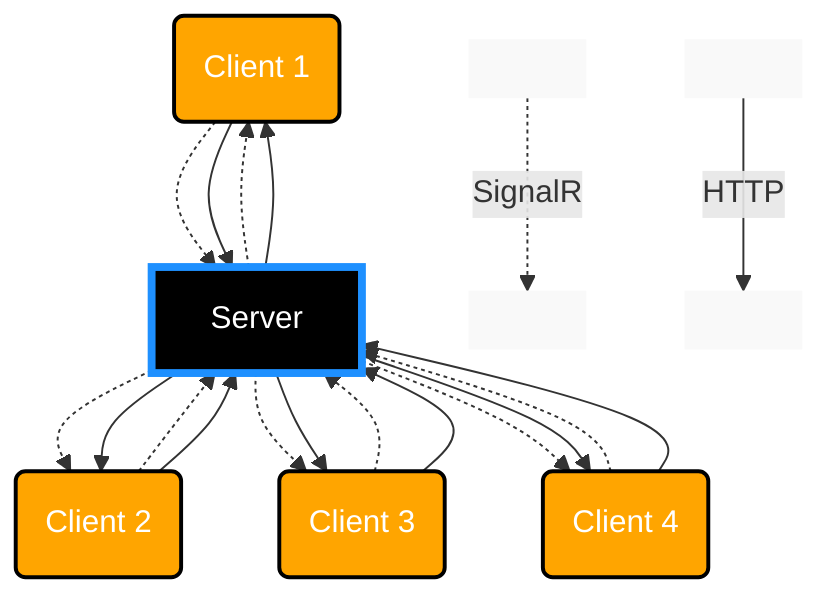

# ORM Project Code-First and Database-First

## Team Members

* Simon
* PandaOnCaffeine (Tue)
* Quan (Andreas)

# The project plan:

## Code-First

### Step 1
...
### Step 2
...

##Database-First

### Step 1
...
### Step 2
...

